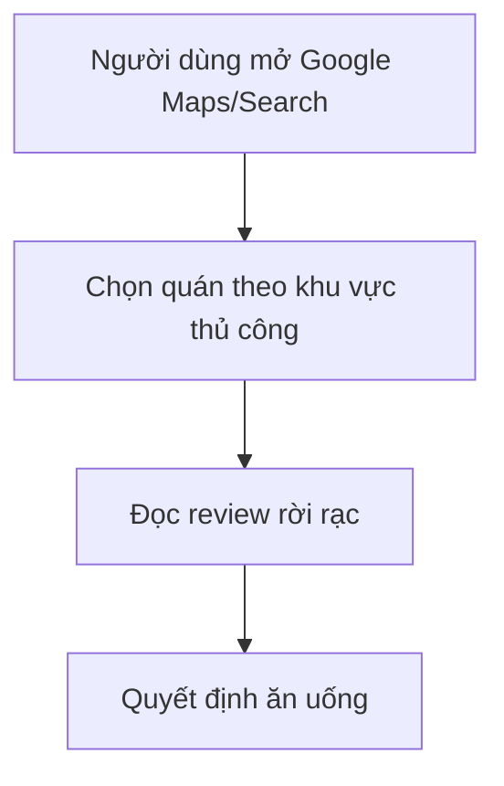

# PRD: Mango — Khám phá quán ăn gần tôi (MVP: ăn uống)

**Version:** 1.0  
**Ngày tạo:** 23/03/2026  
**PO/PM / BA:** [TBD]  
**Status:** Draft  

---

## 1. Tổng quan (Overview)

### 1.1 Problem Statement
Người dùng ở Hà Nội khi không biết ăn gì thường dựa vào Google Maps nhưng gặp các vấn đề:
- Review/đánh giá phân tán, khó so sánh nhanh theo các khía cạnh mình quan tâm.
- Không có cơ chế “cộng đồng” giúp sàng lọc nội dung chất lượng theo tương tác.
- Quyết định nhanh trong bán kính gần (tối đa 5km) còn chậm, thiếu cá nhân hóa.

### 1.2 Product Vision
Mango giúp người dùng mở app lên là thấy danh sách quán ăn phù hợp quanh vị trí của họ, có review chi tiết và điểm tổng hợp rõ ràng. Điểm và nội dung review được nuôi bằng cơ chế cộng tác viên (payout theo tương tác) để tăng chất lượng. Hệ thống ưu tiên trải nghiệm browsing với cá nhân hóa dựa trên hành vi.

### 1.3 Mục tiêu (Goals)
- **Business goal:** Tăng số lượng review chất lượng thông qua cơ chế trả tiền cho cộng tác viên dựa trên tương tác và “hữu ích”.
- **User goal:** Giảm thời gian ra quyết định ăn uống bằng danh sách quán xếp hạng hợp lý trong bán kính 5km kèm review chi tiết.
- **Non-goal:** MVP không tập trung “chỗ chơi”; không tạo xác thực quán theo flow phức tạp. Xác thực/điều tra do admin thực hiện khi có khiếu nại/báo xấu.

### 1.4 Success Metrics (KPIs)
| Metric | Baseline | Target | Thời hạn |
|--------|----------|--------|---------|
| Time-to-Decision (giảm) | TBD | -20% | Sau MVP 8 tuần |
| Conversion review (tỷ lệ người xem -> viết review) | TBD | +X% | Sau MVP 8 tuần |
| Tỷ lệ vote “hữu ích”/review | TBD | +Y% | Sau MVP 8 tuần |
| Engagement list browsing | TBD | +X% | Sau MVP 8 tuần |
| Trust (review bị gỡ do report xấu) | TBD | <= Z% | Liên tục |

---

## 2. Quy trình nghiệp vụ (Business Processes)

### 2.1 Hiện trạng (AS-IS Process)
Người dùng tìm kiếm quán ăn trên Google Maps, đọc review phân tán và tự so sánh thủ công.



**Pain points gốc rễ:**
- Thông tin review không được chuẩn hóa theo các tiêu chí rõ ràng.
- Không có “sàng lọc cộng đồng” theo tương tác để đẩy nội dung chất lượng.
- Cá nhân hóa và xếp hạng phù hợp nhu cầu còn hạn chế.

### 2.2 Quy trình đề xuất (TO-BE Process)

```mermaid
flowchart TD
  U[Người dùng mở Mango] --> G[GPS / Fallback quận-huyện]
  G --> L[Nhận danh sách quán trong 5km (browsing)]
  L --> Q[Chọn quán -> xem chi tiết]
  Q --> RV[Đọc review: điểm tổng hợp + breakdown]
  RV --> W[Đăng nhập -> viết review]
  RV --> V[Vote up/down + vote hữu ích + comment]
  V --> A[Admin: điều tra vote/review theo report]
  RV --> P[Payout cho reviewer theo công thức (cap 10k/review)]
  W --> R1[Tạo trang quán khi có review đầu tiên]
  R1 --> Pay[Quán trả 100k khi admin duyệt]
```

---

## 3. Stakeholders & Users

### 3.1 Stakeholders
| Vai trò | Trách nhiệm |
|---------|-------------|
| Product Owner | Quyết định scope MVP & ưu tiên phát triển |
| Tech Lead | Đánh giá feasibility của backend, scoring, moderation |
| QA | Xây dựng test plan cho flow review/vote/payout/subscription |
| Admin (Backoffice) | Quản lý reviewer/quán, duyệt điều kiện thu phí quán, điều tra vote |
| Reviewer/Cộng tác viên | Viết review, tham gia vote/helpful/comment |
| Restaurant Owner | Gửi phí đăng tải 100k (sau review đầu tiên) để unlock tính năng trang quán |
| Người dùng cuối | Browsing list và xem review; subscribe 6 tháng để xem danh sách |

### 3.2 Target Users / Personas
**Persona 1: Người quyết định nhanh**
- **Mô tả:** Người đi ăn ở Hà Nội, cần chọn nhanh trong bán kính gần.
- **Pain points:** Review phân tán, khó so sánh; cá nhân hóa yếu; thời gian quyết định dài.
- **Goals:** Xem danh sách phù hợp, hiểu rõ điểm mạnh/yếu từng quán theo tiêu chí mình quan tâm.
- **Behavior:** Mở app, nhìn list, click vài quán để so sánh, đọc review và món nên thử.

**Persona 2: Reviewer/cộng tác viên**
- **Mô tả:** Người hay đi ăn, muốn đóng góp review và được nhận payout theo tương tác.
- **Pain points:** Cần động lực và cơ chế thưởng minh bạch.
- **Goals:** Viết review chất lượng, nhận payout dựa trên views/vote/helpful/comment.
- **Behavior:** Đăng review, trả lời/điều chỉnh nội dung theo phản hồi cộng đồng (trang Mango làm rõ quy tắc comment/vote).

### 3.3 User Journey (Happy Path)
1. Người dùng mở Mango, cấp GPS hoặc dùng fallback Ba Đình.
2. Mango hiển thị danh sách quán trong bán kính 5km theo xếp hạng (browsing).
3. Người dùng chọn một quán để xem trang quán và review chi tiết/breakdown 5 thang.
4. Người dùng đăng nhập, viết review và chấm điểm 5 thang (1-5) + mô tả + món nên thử.
5. Người dùng vote up/down, đánh dấu “hữu ích”, comment (comment chỉ dành cho user).

---

## 4. Mô hình tổng quan sản phẩm (Product Overview Model)


*Mô tả: Sơ đồ bối cảnh/hệ thống (TBD: chạy `/ba-infographic-gen` sau khi PRD xong nếu cần asset).*

| Tên thành phần | Ý nghĩa / Vai trò |
|----------------|-------------------|
| Mango Client (Web/App) | UI danh sách, chi tiết quán, review, vote, subscribe |
| Backend API | Xử lý GPS/query, nhận dữ liệu cào, tính điểm/bảng xếp hạng, quản lý review/vote |
| Moderation/Admin Console | Quản lý reviewer/quán, điều tra vote, xử lý report xấu, duyệt thu phí quán |
| Payout Engine | Tính payout theo tương tác (linear + cap 10k/review) |
| Payment/Subscription Module | Gating người dùng 6 tháng; thu 100k phí quán sau duyệt |
| Data Pipeline | Cào/ingest dữ liệu public Google Maps |

---

## 5. Phạm vi dự án & Lộ trình (Scope & Roadmap)

### 4.1 Deployment Roadmap (Lộ trình triển khai tổng thể)
| Phase | Tên giai đoạn / Mục tiêu chính | Thời gian dự kiến |
|-------|--------------------------------|-------------------|
| Phase 1 (MVP) | Danh sách + review + vote + admin + payout cơ bản + gating subscription | Q2/2026 (TBD) |
| Phase 2 | Mở rộng danh mục (chỗ chơi), cải tiến cá nhân hóa/weights, tối ưu scraping/quality | Q3/2026 (TBD) |
| Phase 3 | Tích hợp hệ sinh thái và tự động moderation nâng cao | Q4/2026 (TBD) |

### 4.2 Triển khai trong Giai đoạn gần nhất (In-Scope - Phase 1)
- Lấy vị trí (GPS/fallback quận/huyện), lọc quán trong bán kính 5km.
- Trang danh sách theo browsing (list-first) + xếp hạng (TBD thuật toán).
- Trang quán tạo từ review đầu tiên.
- Review có 5 thang điểm (1-5) + nội dung + giá + giờ mở cửa + độ đông + món nên thử.
- Vote up/down + vote “hữu ích” + comment (comment tăng tương tác).
- Admin backoffice: quản lý reviewer/quán, điều tra vote, xử lý report xấu.
- Payout cộng tác viên: công thức tuyến tính (TBD weights) với trần 10k/review; chi trả theo tuần/tháng.
- Subscription người dùng: gói 6 tháng, gating áp dụng từ khi tải app.
- Cơ chế phí quán: quán trả 100k 1 lần khi admin duyệt; trước khi trả thì quán không trả lời bình luận và không thay ảnh.

### 4.3 Những Hạng mục CHƯA Triển khai (Out-of-Scope & Postponed)
| Tính năng/Hạng mục | Lý do hoãn (Nguyên nhân) | Dự kiến Phase tiếp theo |
|--------------------|---------------------------|-------------------------|
| Danh mục “chỗ chơi” | MVP tập trung ăn uống | Phase 2 |
| Xác thực quán phức tạp | MVP dùng rule admin khi có report | TBD |
| Unlock full tính năng trang quán theo thời gian chi tiết | Thuộc phần PRD/NFR sau | Phase 2 |
| Thiết kế hệ thống point/ban cho reviewer phức tạp | Cần thêm dữ liệu chống thao túng | Phase 2 |
| A/B test diện rộng | Cần nền tảng analytics/experimentation | Phase 2 |

### 4.4 Assumptions & Dependencies
- Dữ liệu cào từ Google Maps công khai tuân thủ policy sử dụng dữ liệu của nguồn (và/hoặc có giấy phép).
- Có một Payment Provider để xử lý subscription (6 tháng) và phí quán 100k (cổng thanh toán TBD).
- Admin backoffice có thể điều tra vote và xử lý report xấu kịp thời.
- Ranking weights (`w1/w2/w3`) và payout weights (`base/a/b/c/d`) sẽ được chốt sau (hiện PRD để placeholder).

---

## 6. Functional Requirements & Business Rules

> Ưu tiên theo MoSCoW: M = Must Have | S = Should Have | C = Could Have | W = Won't Have

### 6.1 Epic 1: Location Search & Restaurant List (Mango browsing)
**Mô tả Epic:** Hiển thị danh sách quán ăn trong bán kính 5km theo vị trí người dùng, ưu tiên list-first để browsing.

| ID | User Story | Acceptance Criteria | Priority |
|----|------------|---------------------|----------|
| FR-001 | Là người dùng, tôi muốn mở Mango và thấy list quán trong 5km quanh tôi | GIVEN mở app THEN lấy GPS nếu có quyền; ELSE fallback theo quận/huyện và mặc định Ba Đình; WHEN load list THEN chỉ hiển thị quán trong bán kính 5km | M |
| FR-002 | Là người dùng, tôi muốn xem list theo xếp hạng phù hợp | GIVEN có dữ liệu review/vote THEN list được sắp xếp theo ranking (TBD weights) và có hiển thị điểm tổng hợp | M |
| FR-003 | Là người dùng, tôi muốn gating subscription khi mở app | GIVEN chưa có subscription hợp lệ THEN gating áp dụng ngay lúc tải app (TBD chi tiết giới hạn/preview) | M |

**Business Rules & Workflows logic:**
- Bán kính tìm kiếm tối đa: 5km.
- Ranking: `finalScore = w1 * communityScore + w2 * personalAffinity + w3 * distanceScore` (TBD weights/chuẩn hóa).
- DistanceScore được chuẩn hóa trong [0..1] (TBD), personalAffinity suy từ browsing/vote/helpful (TBD).

### 6.2 Epic 2: Restaurant Detail & Review Display
**Mô tả Epic:** Cho phép người dùng xem trang quán và review chi tiết, gồm điểm tổng hợp và breakdown 5 thang.

| ID | User Story | Acceptance Criteria | Priority |
|----|------------|---------------------|----------|
| FR-004 | Là người dùng, tôi muốn xem chi tiết quán và review | GIVEN người dùng mở trang quán THEN hiển thị điểm tổng hợp + breakdown 5 thang + danh sách review | M |
| FR-005 | Là người dùng, tôi muốn hiểu “món nên thử” và thông tin review | GIVEN một review THEN hiển thị: giá/giờ mở cửa/độ đông/món nên thử + nội dung chữ | M |

**Business Rules & Workflows logic:**
- Review score: trung bình cộng `food/price/service/space/hygiene` (mỗi thang 1-5).

### 6.3 Epic 3: Write Review (Auth required)
**Mô tả Epic:** Người dùng đăng nhập để viết review; không cho ẩn danh; profile không có thông tin cá nhân.

| ID | User Story | Acceptance Criteria | Priority |
|----|------------|---------------------|----------|
| FR-006 | Là người dùng, tôi muốn viết review cho quán | GIVEN đã đăng nhập THEN user nhập đầy đủ fields (điểm 5 thang 1-5 + nội dung + giá + giờ mở cửa + độ đông + món nên thử) và submit thành review hợp lệ | M |
| FR-007 | Là người dùng, tôi có thể viết nhiều review | GIVEN đã đăng nhập THEN hệ thống cho phép viết review không giới hạn số lượng (theo rule MVP; moderation có thể giới hạn nếu phát hiện spam) | M |

**Business Rules & Workflows logic:**
- Tất cả reviewer phải đăng nhập.
- Chuẩn hóa dữ liệu: rating là số nguyên 1-5; các field định dạng theo schema (TBD).

### 6.4 Epic 4: Voting, Helpful & Comments
**Mô tả Epic:** Người dùng tương tác để nâng chất lượng và tạo tín hiệu payout.

| ID | User Story | Acceptance Criteria | Priority |
|----|------------|---------------------|----------|
| FR-008 | Là người dùng, tôi muốn vote up/down cho review | GIVEN review THEN user vote up/down được 1 lần theo review (TBD: có thể thay đổi không) | M |
| FR-009 | Là người dùng, tôi muốn đánh dấu “hữu ích” cho review | GIVEN review THEN user bấm “hữu ích”; count được dùng cho payout | M |
| FR-010 | Là người dùng, tôi muốn comment | GIVEN quán chưa trả 100k THEN comment chỉ thuộc về user (không có reply từ quán) | M |

**Business Rules & Workflows logic:**
- `helpfulCount` tăng khi user bấm “hữu ích”.
- `commentCount` tăng khi có comment từ user.
- Trước khi quán trả 100k: quán không trả lời bình luận và không thay ảnh.

### 6.5 Epic 5: Personalization (MVP)
**Mô tả Epic:** Cá nhân hóa danh sách dựa trên hành vi browsing/vote/helpful.

| ID | User Story | Acceptance Criteria | Priority |
|----|------------|---------------------|----------|
| FR-011 | Là người dùng, tôi muốn list gợi ý phù hợp hơn theo sở thích | GIVEN đủ dữ liệu hành vi tối thiểu THEN hệ thống cập nhật personalAffinity để ảnh hưởng ranking (TBD) | S |

**Business Rules & Workflows logic:**
- PersonalAffinity được suy từ: click/visit quán, vote/helpful và thời điểm tương tác (TBD cách map sang vector/score).

### 6.6 Epic 6: Payout for Reviewers (linear + cap)
**Mô tả Epic:** Tính payout cộng tác viên theo tương tác. Trần 10k/review.

| ID | User Story | Acceptance Criteria | Priority |
|----|------------|---------------------|----------|
| FR-012 | Là reviewer, tôi muốn nhận payout dựa trên tương tác với review | GIVEN review đã được publish công khai THEN payout được tính theo công thức tuyến tính và bị giới hạn trần | M |
| FR-013 | Là reviewer, tôi muốn hệ thống minh bạch payout | WHEN payout batch chạy THEN hệ thống ghi log công thức đầu vào/đầu ra (TBD chi tiết UI) | S |

**Business Rules & Workflows logic:**
- Payout inputs: `views`, `voteUp`, `voteDown`, `helpfulCount`, `commentCount`.
- Công thức (weights TBD):
  - `payout = min(10000, base + a*views + b*(voteUp - voteDown) + c*helpfulCount + d*commentCount)`
- Chi trả qua chuyển khoản trực tiếp; chu kỳ chi trả: tuần hoặc tháng (TBD).

### 6.7 Epic 7: Admin Moderation & Vote Investigation
**Mô tả Epic:** Admin xử lý report xấu, điều tra vote và quyết định action.

| ID | User Story | Acceptance Criteria | Priority |
|----|------------|---------------------|----------|
| FR-014 | Là admin, tôi muốn quản lý reviewer/quán | GIVEN admin đăng nhập THEN có CRUD cơ bản/manage trạng thái | M |
| FR-015 | Là admin, tôi muốn điều tra vote thao túng | GIVEN có report THEN admin xem lịch sử vote, đánh giá bất thường (TBD) và quyết định action | M |
| FR-016 | Là admin, tôi muốn xử lý khiếu nại/báo xấu | GIVEN có report xấu THEN admin có thể ẩn/gỡ nội dung hoặc xử phạt reviewer/quán (TBD chính sách) | M |

**Business Rules & Workflows logic:**
- Không duyệt review trước khi lên public (MVP).
- Admin có quyền điều tra và xử lý khi có báo xấu.

### 6.8 Epic 8: Restaurant Page Fee & Publish Unlock
**Mô tả Epic:** Tạo trang quán khi có review đầu tiên; sau đó quán trả 100k 1 lần để unlock.

| ID | User Story | Acceptance Criteria | Priority |
|----|------------|---------------------|----------|
| FR-017 | Là system, tôi muốn tạo trang quán khi có review đầu tiên | GIVEN restaurant có review đầu tiên THEN RestaurantPage được tạo ngay | M |
| FR-018 | Là admin/system, tôi muốn duyệt thu phí đăng tải | GIVEN restaurantpage đã tồn tại THEN khi admin duyệt trạng thái đăng tải, hệ thống thu phí 100k 1 lần | M |
| FR-019 | Là quán, tôi muốn unlock phần “trả lời/tải ảnh” sau khi trả phí | GIVEN quán đã thanh toán + admin duyệt THEN cho phép reply bình luận và thay ảnh (unlock) | M |

**Business Rules & Workflows logic:**
- Trước khi quán trả 100k:
  - Không cho quán trả lời bình luận.
  - Không cho quán thay ảnh (chỉ cho xem).
- Sau khi trả 100k (và admin duyệt):
  - Quán được unlock reply bình luận và thay ảnh (TBD chi tiết UI/permissions).

### 6.9 Epic 9: User Subscription (6 months)
**Mô tả Epic:** Gating browsing theo gói subscription 6 tháng.

| ID | User Story | Acceptance Criteria | Priority |
|----|------------|---------------------|----------|
| FR-020 | Là người dùng, tôi muốn trả phí 6 tháng để tiếp tục xem danh sách | GIVEN user chưa subscribe THEN gating kích hoạt ngay khi tải app; user subscribe thành công THEN truy cập danh sách/browsing | M |

**Business Rules & Workflows logic:**
- Áp dụng từ khi tải app.
- Chi tiết behavior khi không có subscription: preview limit/CTA TBD (open question).

---

## 7. Data & Technical Considerations

### 6.1 Architecture Notes
- Client:
  - lấy GPS (permission) khi mở app,
  - gọi API search: `GET /restaurants?lat=&lng=&radius=5km&district=...`
  - render list + detail + review forms.
- Backend:
  - ingest pipeline từ Google Maps (public) -> lưu vào database `Restaurant`/`Place`.
  - aggregation:
    - tính average rating theo 5 thang,
    - tính community metrics (views/votes/helpful/comments).
  - ranking service:
    - tính `finalScore` (weights TBD),
    - personalAffinity model (MVP: rules-based).
  - moderation:
    - lưu report,
    - admin action (hide review, adjust votes/payout policy, etc).
  - payout engine:
    - batch job tính payout theo công thức linear (weights TBD) và cap 10k/review.
- Subscription/payment:
  - kiểm tra token/entitlement trước khi trả response danh sách.

### 6.2 Integrations
| Hệ thống | Loại tích hợp | Mục đích |
|----------|---------------|----------|
| Google Maps (public) | Data ingestion/crawling | Lấy dữ liệu quán ban đầu |
| Auth provider | OAuth/email-password (TBD) | Bắt buộc đăng nhập để review |
| Payment provider | Payment API/Webhook (TBD) | Thu 100k phí quán và subscription 6 tháng |
| Notification (optional) | Email/Push | Thông báo payout batch (TBD) |

---

## 8. Non-Functional Requirements

### 8.1 Non-Functional Requirements (NFRs)
| Loại | Yêu cầu | Ghi chú |
|------|---------|---------|
| Performance | Page load < 3s, API response P95 < 500ms | Danh sách ưu tiên caching/partial loads |
| Availability | 99.9% uptime | |
| Security | JWT auth, HTTPS only, RBAC cho admin; rate limiting | |
| Scalability | Hỗ trợ tăng trưởng review/vote và tải search theo bán kính | |
| Privacy | Không thu thập thông tin cá nhân nhạy cảm ở profile | Profile reviewer tối giản |

### 8.2 Analytics & Tracking Events
| Event Name | Trigger | Properties cần track |
|------------|---------|-----------------------|
| mango_list_viewed | Khi list hiển thị | user_id(optional), session_id, lat/lng bucket, district |
| mango_restaurant_opened | Click vào quán | user_id(optional), restaurant_id, source |
| mango_review_started | Mở form review | user_id, restaurant_id |
| mango_review_submitted | Submit review | user_id, restaurant_id, ratings breakdown |
| mango_vote_submitted | Vote up/down | user_id, review_id, vote_type |
| mango_helpful_clicked | Bấm hữu ích | user_id, review_id |
| mango_comment_submitted | Gửi comment | user_id, review_id, comment_length_bucket |
| mango_subscription_prompted | Khi gating xuất hiện | user_id(optional), page |
| admin_moderation_action | Admin xử lý report | admin_id, report_id, action_type |

---

## 9. Risks & Open Q&A

### 9.1 Risks & Mitigation
| Rủi ro | Khả năng xảy ra | Mức độ ảnh hưởng | Cách giảm thiểu |
|--------|------------------|-------------------|-----------------|
| Review spam/đánh giá giả mạo | Trung | Cao | Bắt buộc login, theo dõi hành vi, admin điều tra vote/report |
| Payout bị lợi dụng | Trung | Cao | Cap 10k/review, investigation admin, audit trail |
| Scraping vi phạm policy | Thấp-Trung | Cao | Tuân thủ điều khoản nguồn, giảm tần suất, lưu bằng chứng pháp lý nếu cần |
| Ranking cá nhân hóa sai gây giảm trải nghiệm | Trung | Trung | Bắt đầu rule-based, theo dõi KPI, hiệu chỉnh weights sau |
| Gating subscription gây giảm thu hút | Trung | Trung | Cho phép preview giới hạn/triển khai CTA rõ ràng (TBD) |

### 9.2 Open Questions
| # | Câu hỏi | Owner | Status |
|---|---------|-------|--------|
| 1 | Trọng số payout `base/a/b/c/d` chốt theo ngân sách như thế nào? | BA/PO | Open |
| 2 | Ranking weights `w1/w2/w3` và chuẩn hóa score (distance/personalAffinity) chốt ra sao? | Tech Lead/BA | Open |
| 3 | Subscription gating hành vi khi chưa subscribe: preview limit bao nhiêu, có xem chi tiết tối đa không? | PO/BA | Open |
| 4 | Payout chi trả theo tuần hay tháng (mặc định) và thời gian batch? | Ops/BA | Open |
| 5 | Trước khi quán trả 100k: quán có bị giới hạn quyền nào khác ngoài comment reply và ảnh? | PO/BA | Open |

---

## 10. Appendix (Phụ lục)
- Reference: “INPUT SPEC (Kết quả khơi gợi yêu cầu) — Mango MVP (ăn uống gần tôi)” trong `D:\Mango\.agent\workflows\ba-prd-create.md`

